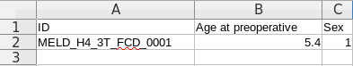

# Compute the harmonisation parameters for a new site/scanner

This guidelines will explain how to compute the harmonisation parameters needed to predict lesions on patients from new epilepsy centres, new MRI scanners or updated T1 / FLAIR sequences that were not used to train the MELD classifier. 

Note: 
- Demographic information (e.g age and sex) will be required for this process.
- If you are from an epilepsy centre who's data was used to train the classifier, you can directly refer to the guidelines from the [Predict_on_new_patient](Predict_on_new_patient.md)

In the following, we describe the steps needed to compute the harmonisation parameters for a new site. Once you have done the process once, you can follow the general guidelines from[Predict_on_new_patient](Predict_on_new_patient.md) to predict on your new subject.

## Disclaimer

The MELD surface-based FCD detection algorithm is intended for research purposes only and has not been reviewed or approved by the Medicines and Healthcare products Regulatory Agency (MHRA), European Medicine Agency (EMA) or by any other agency. Any clinical application of the software is at the sole risk of the party engaged in such application. There is no warranty of any kind that the software will produce useful results in any way. Use of the software is at the recipient's own risk.

## Information about the pipeline
Before running the below pipeline, ensure that you have [installed MELD classifier](README.md#installation) and activate the meld_classifier environment : 
```bash
conda activate meld_classifier
```
Also you need to make sure that Freesurfer is activated in your terminal (you should have some printed FREESURFER paths when opening the terminal). Otherwise you will need to manually activate Freesurfer on each new terminal by running : 
```bash
export FREESURFER_HOME=<freesurfer_installation_directory>/freesurfer
source $FREESURFER_HOME/SetUpFreeSurfer.sh
```
with `<freesurfer_installation_directory>` being the path to where your Freesurfer has been installed.


## Compute the harmonisation paramaters 

The harmonisation parameters are computed using [Distributed Combat](https://doi.org/10.1016/j.neuroimage.2021.118822).
To get these parameters you will need a small cohort of subjects acquired from the same scanner and under the same protocol (sequence, parameters, ...).
Subjects can be controls and/or patients, but we advise to use ***at least 30 subjects*** to enable an accurate harmonisation. 
Try to ensure the data are high quality (i.e no blurring, no artefacts, no cavities in the brain).

### Get your new site code !
Prior everything you should contact the MELD team by mail (MELD.study@gmail.com) to get your new site_code. Don't forget to mention your institution and provide us with a mail for contact. This code will be needed to organise your data and run the code as detailled below. 

### First step - Organising your data!

(Comming soon: enable BIDS format)

You will need to organise the MRI data of the subjects

In the 'input' folder where your meld data has / is going to be stored, create a folder for each patient.

The IDs should follow the structure MELD\_<site\_code>\_<scanner\_field>\_FCD\_000X

e.g.MELD\_H1\_3T\_FCD\_0001 

In each patient folder, create a T1 and FLAIR folder.

Place the T1 nifti file into the T1 folder. Please ensure 'T1' is in the file name.

Place the FLAIR nifti file into the FLAIR folder. Please ensure 'FLAIR' is in the file name.


IMPORTANT: You will also need to gather demographic information into a csv file as illustrated in the example below:


- ID : MELD ID
- Age at preoperative: The age of the subject at the time of the preoperative T1 scan (in years)
- Sex: 1 if male, 0 if female

This csv file should be placed into your <meld_data_folder>. Alternatively, you can fill in the example 'demographics_file.csv' already provided in this folder. 


### Second step : Run the pipeline to get the harmonisation parameters

You will need to make sure you are in the folder containing the MELD classifier scripts
```bash
  cd <path_to_meld_classifier_folder>
```

To compute the harmonisation parameters for your new site you can use the pipeline below:

```bash
python scripts/new_patient_pipeline/new_pt_pipeline.py -site <site_code> -ids <subjects_list> -demos <demographic_file> --harmo_only
```

Note: This command will segment the brain using Freesurfer, extract the features and compute the harmonisation parameters, for the subjects provided in the subjects list. If you wish to also get the predictions on these subjects you can remove the flag '--harmo_only'. 


You can tune this command using additional variables and flags as detailed bellow:

| **Mandatory variables**         |  Comment | 
|-------|---|
| ```-site <site_code>```  |  The site code should start with H, e.g. H1. If you cannot remember your site code - contact the MELD team. | 
|either ```-id <subject_id>```  |  if you want to run the pipeline on 1 single subject. Needs to be in MELD format MELD\_<site\_code>\_<scanner\_field>\_FCD\_000X |  
|or ```-ids <subjects_list>``` |  if you want to run the pipeline on more than 1 subject, you can pass the name of a text file containing the list of subjects. An example 'subjects_list.txt' is provided in the <meld_data_folder>. | 
|```-demos <demographic_file>```| The name of the csv file containing the demographic information as detailled in the section above. An example 'demographics_file.csv' is provided in the <meld_data_folder>.|
| **Optional variables** |
|```--parallelise``` | use this flag to speed up the segmentation by running Freesurfer/FastSurfer on multiple subjects in parallel. |
|```--fastsurfer``` | use this flag to use FastSurfer instead of Freesurfer. Requires FastSurfer installed. |
|```--skip_segmentation``` | use this flag to skips the segmentation, features extraction and smoothing (processes from script1). Usefull if you already have these outputs and you just want to ran the preprocessing and the predictions (e.g: after harmonisation) |
|```--harmo_only``` | Use this flag to do all the processes up to the harmonisation. Usefull if you want to harmonise on some subjects but do not wish to predict on them |


## What's next ? 
Once you have successfully computed the harmonisation parameters, they should be saved on your <meld_data_folder>.
You can now refer to the guidelines [Predict_on_new_patient.md](Predict_on_new_patient.md) to predict lesion in patients from that same scanner/site.
