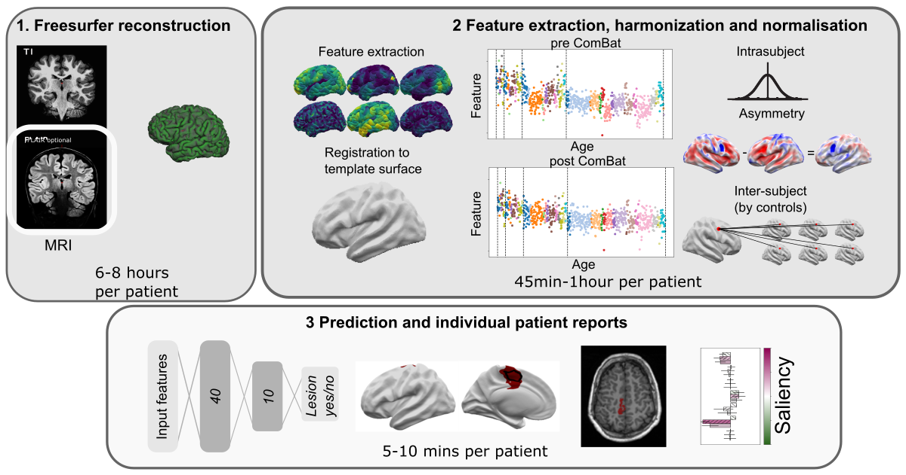
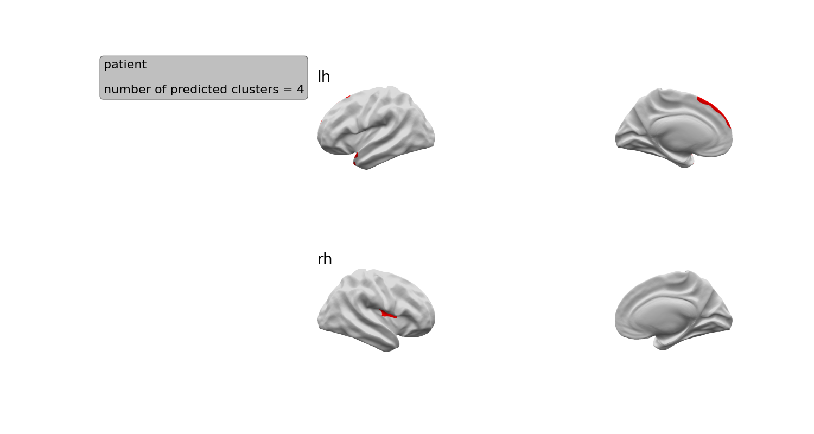
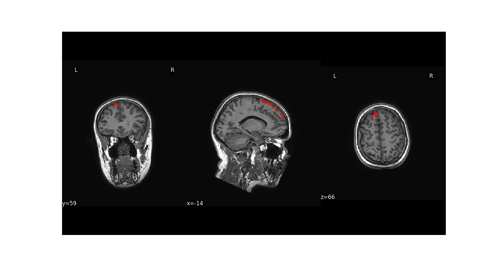
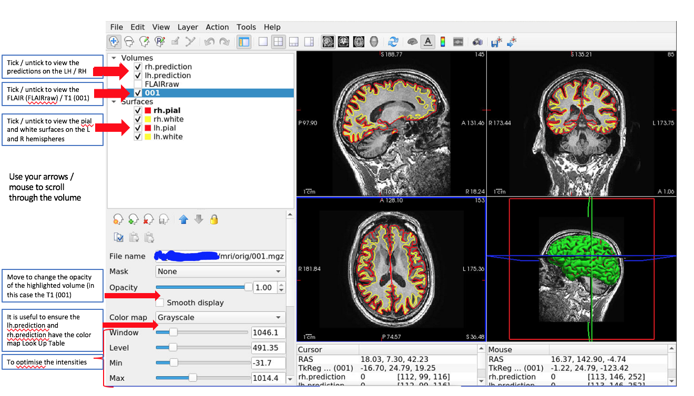
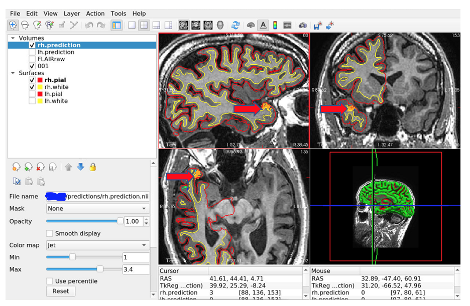

# Predict lesion on a new patient 

With the MELD classifier pipeline, if you are from an epilepsy centre who's data was used to train the classifier, predicting lesion locations on new patients is easy. In the following, we describe the steps needed for predict the trained model on a new patient.
Note: No demographic information are required for this process.

We also have a "Guide to using the MELD surface-based FCD detection algorithm on a new patient from an existing MELD site" (https://docs.google.com/document/d/1TnUdH-p0mXII7aYa6OCxvcn-pnhMDGMOfXARxjK4S-M/edit?usp=sharing). This explains how to run the classifier in much more detail as well as how to interpret the results.

If you would like to predict lesions on patients from new epilepsy centres or new MRI scanners or updated T1 / FLAIR sequences that were not used to train the classifier, you will need to used the Predict_on_patients_from_new_sites pipeline which is under development.
Note: Demographic information (e.g age and sex) will be required for this process.

## Disclaimer

The MELD surface-based FCD detection algorithm is intended for research purposes only and has not been reviewed or approved by the Medicines and Healthcare products Regulatory Agency (MHRA), European Medicine Agency (EMA) or by any other agency. Any clinical application of the software is at the sole risk of the party engaged in such application. There is no warranty of any kind that the software will produce useful results in any way. Use of the software is at the recipient's own risk.

## Information about the pipeline
Before running the below pipeline, ensure that you have [installed MELD classifier](README.md#installation) and activate the meld_classifier environment : 
```bash
  conda activate meld_classifier
```
Also you need to make sure that Freesurfer is activated in your terminal (you should have some printed FREESURFER paths when opening the terminal). Otherwise you will need to manually activate Freesurfer on each new terminal by running : 
```bash
export FREESURFER_HOME=<freesurfer_installation_directory>/freesurfer
source $FREESURFER_HOME/SetUpFreeSurfer.sh
```
with `<freesurfer_installation_directory>` being the path to where your Freesurfer has been installed.

### First step - Organising your data!
You need to organise the MRI data for the patients you want to run the classifier on.

In the 'input' folder where your meld data has / is going to be stored, create a folder for each patient. 

The IDs should follow the same naming structure as before. i.e. MELD\_<site\_code>\_<scanner\_field>\_FCD\_000X

e.g.MELD\_H1\_3T\_FCD\_0001 

In each patient folder, create a T1 and FLAIR folder.

Place the T1 nifti file into the T1 folder. Please ensure 'T1' is in the file name.

Place the FLAIR nifti file into the FLAIR folder. Please ensure 'FLAIR' is in the file name.


### Second step
Go into the meld_classifier folder 
```bash
  cd <path_to_meld_classifier_folder>
```
Each of the 3 following scripts needs to be run from the 'meld_classifier' folder

### Overview new patient pipeline
The pipeline is split into 3 main scripts as illustrated below and detailed after.



### Script 1 - FreeSurfer reconstruction
```bash
python scripts/new_patient_pipeline/new_pt_pipeline_script1.py -id <sub_id>
```
- This script runs a FreeSurfer reconstruction on a participant
- REMINDER: you need to have set up your paths & organised your data before running Script 1 (see Installation)
- We recommend using the same FreeSurfer version that you used to process your patient's data that was used to train the classifier
- Within your  MELD folder should be an input folder that contains folders for each participant. 
- Within each participant folder should be a T1 folder that contains the T1 in nifti format ".nii" and where available a FLAIR folder that contains the FLAIR in nifti format ".nii"

### Script 2 - Feature Preprocessing
```bash
python scripts/new_patient_pipeline/new_pt_pipeline_script2.py -ids <text_file_with_subjects_ids> -site <site_code>
```
- The site code should start with H, e.g. H1. If you cannot remember your site code - contact the MELD team.
- This script:
1. Extracts surface-based features needed for the classifier :
* Samples the features
* Creates the registration to the template surface fsaverage_sym
* Moves the features to the template surface
* Write feature in hdf5
2. Preprocess features : 
* Smooth features and write in hdf5
* Combat harmonised and write in hdf5
* Normalise the smoothed features (intra-subject & inter-subject (by controls)) and write in hdf5
* Normalise the raw combat features (intra-subject, asymmetry and then inter-subject (by controls)) and write in hdf5

### Script 3 - Lesions prediction & MELD reports
```bash
python scripts/new_patient_pipeline/new_pt_pipeline_script3.py -ids <text_file_with_subjects_ids> -site <site_code>
```
- The site code should start with H, e.g. H1. If you cannot remember your site code - contact the MELD team.
- Features need to have been processed using script 2 and Freesurfer outputs need to be available for each subject
- This script : 
1. Run the MELD classifier and predict lesion on new subject
2. Register the prediction back into the native nifti MRI. Results are stored in inputs/<sub_id>/predictions.
3. Create MELD reports with predicted lesion location on inflated brain, on native MRI and associated saliencies. Reports are stored in Results are stored in inputs/<sub_id>/predictions/reports.

## Interpretation of results
The precalculated .png images of predicted lesions and their associated saliencies can be used to look at the predicted clusters and why they were detected by the classifier. 

After viewing these images, we recommend then viewing the predictions superimposed on the T1 volume. This will enable:
- Re-review of the T1 /FLAIR at the predicted cluster locations to see if an FCD can now be seen
- Performing quality control
- Viewing the .png images of predicted lesions

### Viewing the predicted clusters
The .png images of the predicted lesions are saved in the folder:
 /input/<sub_id>/predictions/reports

The first image is called inflatbrain_<sub_id>.png



This image tells you the number of predicted clusters and shows on the inflated brain where the clusters are located.

The next images are mri_<sub_id>_<hemi>_c*.png

E.g. 



These images show the cluster on the volumetric T1 image. Each cluster has its own image e.g.  mri_<sub_id>_<hemi>_c1.png for cluster 1 and  mri_<sub_id>_<hemi>_c2.png for cluster 2.

Please note: images are NOT shown in radiological convention (we are working on code to do this)
  
### Saliency
  
The next images are called saliency_<sub_id>_<hemi>_c*.png. Each cluster has a saliency image associated with it. E.g.
  

  
These detail:
* The hemisphere the cluster is on
* The surface area of the cluster (across the cortical surface)
* The location of the cluster
* The z-scores of the patient’s cortical features averaged within the cluster. In this example, the most abnormal features are the intrinsic curvature (folding measure) and the sulcal depth.
* The saliency of each feature to the network - if a feature is brighter pink, that feature was more important to the network. In this example, the intrinsic curvature is most important to the network’s prediction

The features that are included in the saliency image are:
* **Grey-white contrast**: indicative of blurring at the grey-white matter boundary, lower z-scores indicate more blurring
* **Cortical thickness**: higher z-scores indicate thicker cortex, lower z-scores indicate thinner cortex
* **Sulcal depth**: higher z-scores indicate deeper average sulcal depth within the cluster
* **Intrinsic curvature**: a measure of cortical deformation that captures folding abnormalities in FCD. Lesions are usually characterised by high z-scores
* **WM FLAIR**: FLAIR intensity sampled at 1mm below the grey-white matter boundary. Higher z-scores indicate relative FLAIR hyperintensity, lower z-scores indicate relative FLAIR hypointensity
* **GM FLAIR**: FLAIR intensity sampled at 50% of the cortical thickness. Higher z-scores indicate relative FLAIR hyperintensity, lower z-scores indicate relative FLAIR hypointensity
* **Mean curvature**: Similar to sulcal depth, this indicates whether a vertex is sulcal or gyral. Its utility is mainly in informing the classifier whether a training vertex is gyral or sulcal. Within FCD lesions, it is usually not characterised by high z-scores or high saliency.

If you only provide a T1 image, the FLAIR features will not be included in the saliency plot.

## Viewing the predictions on the T1 and quality control

It is important to check that the clusters detected are not due to obvious FreeSurfer reconstruction errors, scan artifacts etc.

To do this run: 
```bash
cd <path_to_meld_classifier>
conda activate meld_classifier
python scripts/new_patient_pipeline/new_pt_qc_script.py -id <sub_id>
```


This will open FreeView and load the T1 and FLAIR (where available) volumes as well as the classifier predictions on the left and right hemispheres. It will also load the FreeSurfer pial and white surfaces. It will look like this:

You can scroll through and find the predicted clusters.


Example of a predicted cluster (orange) on the right hemisphere. It is overlaid on a T1 image, with the right hemisphere pial and white surfaces visualised. Red arrows point to the cluster. 

**Things to check for each predicted cluster:**

1. Are there any artifacts in the T1 or FLAIR data that could have caused the classifier to predict that area?

2. Check the .pial and .white surfaces at the locations of any predicted clusters. 
Are they following the grey-white matter boundary and pial surface? If not, you need to try and establish if this is just a reconstruction error or if the error is due to the presence of an FCD. If it is just an error or due to an artifact, exclude this prediction. If it is due to an FCD, be aware that the centroid  / extent of the lesion may have been missed due to the reconstruction error and that some of the lesion may be adjacent to the predicted cluster. 

Note: the classifier is only able to predict areas within the pial and white surfaces.

## Limitations 

**Limitations to be aware of:**

* If there is a reconstruction error due to an FCD, the classifier will only be able to detect areas within the pial and white surfaces and may miss areas of the lesion that are not correctly segmented by FreeSurfer
* There will be false positive clusters. You will need to look at the predicted clusters with an experienced radiologist to identify the significance of detected areas
* The classifier has only been trained on FCD lesions and we do not have data on its ability to detect other pathologies e.g. DNET / ganglioglioma / polymicrogyria. As such, the research tool should only be applied to patients with FCD / suspected FCD
* Performance of the classifier varies according to MRI field strength, data available (e.g. T1 or T1 and FLAIR) and histopathological subtype. For more details of how the classifier performs in different cohorts, see (https://www.medrxiv.org/content/10.1101/2021.12.13.21267721v1)

## How to cite the classifier
  
Spitzer, H., Ripart, M., Whitaker, K., Napolitano, A., De Palma, L., De Benedictis, A., et al. (2021). Interpretable surface-based detection of focal cortical dysplasias: a MELD study. medRxiv, 2021.12.13.21267721.
