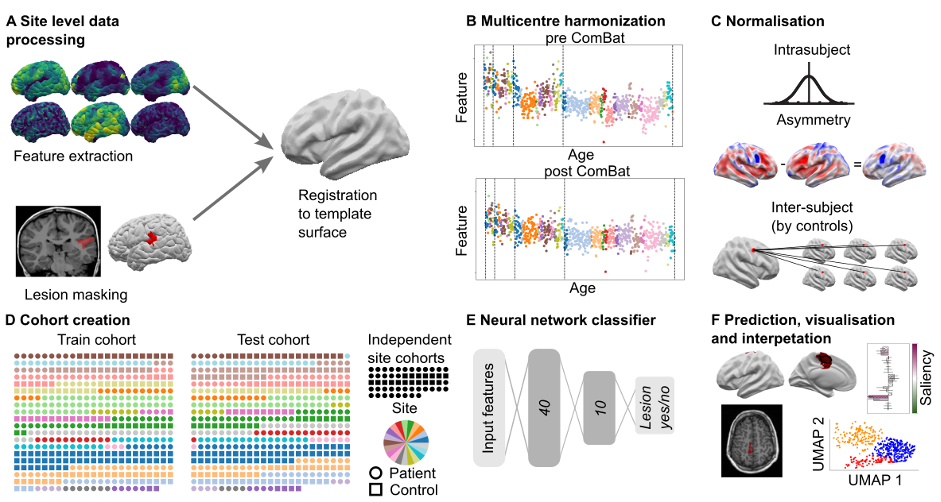

# MELD classifier
Neural network lesion classifier for the MELD project.

The preprint describing the classifier can be found here:
https://www.medrxiv.org/content/10.1101/2021.12.13.21267721v1

*Code Authors : Hannah Spitzer, Mathilde Ripart, Sophie Adler, Konrad Wagstyl*



This package comes with a pretrained model that can be used to predict new subjects. It also contains code for training neural network lesion classifiers on new data.

                               
## Installation

### Prerequisites
For preprocessing, MELD classifier requires [Freesurfer](https://surfer.nmr.mgh.harvard.edu/fswiki/DownloadAndInstall). It is trained on data from versions 6 & v5.3. Please follow instructions on [Freesurfer](https://surfer.nmr.mgh.harvard.edu/fswiki/DownloadAndInstall) to install FreeSurfer v6.

### Conda installation
We use [anaconda](https://docs.anaconda.com/anaconda/install/mac-os/) to manage the environment and dependencies. Please follow instructions on [anaconda](https://docs.anaconda.com/anaconda/install/mac-os/) to install Anaconda.

Install MELD classifier and python dependencies:
```bash
# checkout and install the github repo 
git clone https://github.com/kwagstyl/meld_classifier.git
# enter the meld_classifier directory
cd meld_classifier
# create the meld classifier environment with all the dependencies 
conda env create -f environment.yml
# activate the environment
conda activate meld_classifier
# install meld_classifier with pip (with `-e`, the development mode, to allow changes in the code to be immediately visible in the installation)
pip install -e .
```

### Set up paths and download model
Before being able to use the classifier on your data, some paths need to be set up and the pretrained model needs to be downloaded. For this, run:
```bash
python scripts/prepare_classifier.py
```

This script will ask you for the location of your **MELD data folder** and download the pretrained model and test data to a folder inside your MELD data folder. You can also skip the downloading of the test data. For this, append the option `--skip-download-data` to the python call:
```bash
python scripts/prepare_classifier.py --skip-download-data
```

### FAQs
Please see our [FAQ](USAGE.md#FAQs.md) for common installation problems.

### Verify installation
We provide a test script to allow you to verify that you have installed all packages, set up paths correctly, and downloaded all data. This script will run the pipeline to predict the lesion classifier on a new patient.

TODO add script all 

## Usage
With this package, you can use the provided classifier predict new subjects from existing and new sites. In addition, you can train your own classifier model.
For more details, check out the guides linked below:
- [Predict new subjects (existing site)](USAGE.md#predict-lesion-on-a-new-patient)
- [Predict new subjects (new site)](USAGE.md#predict-lesion-on-a-patient-from-a-new-site) (COMING SOON)
- [Train and evaluate models](USAGE.md#training-and-evaluating-models)

## Contribute
If you'd like to contribute to this code base, have a look at our [contribution guide](DEVELOP.md)

## Manuscript
Please check out our [manuscript](TODO) to learn more. 
An overview of the notebooks that we used to create the figures can be found [here](figure_notebooks.md)
